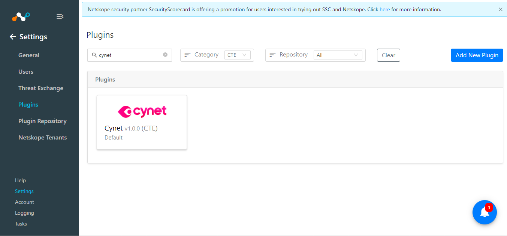
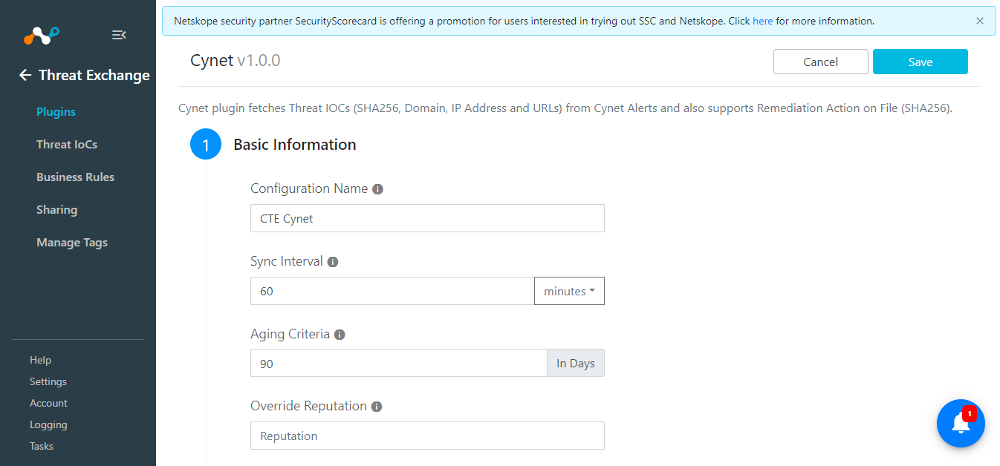
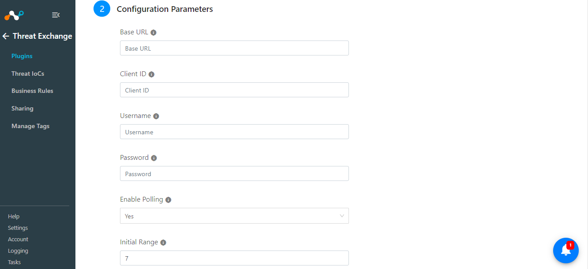
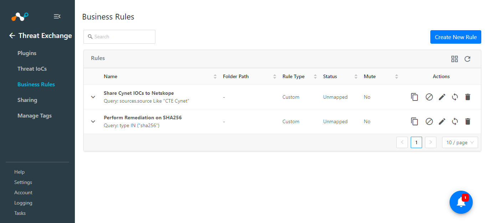

# CTE Cynet v1.0.0 Readme
## Release Notes
### 1.0.0
#### Added
- Initial Release.
- Cynet plugin fetches Threat IOCs (SHA256, Domain, IP Address, and URLs) from Cynet Alerts and also supports Remediation Action on File (SHA256).
## Description

Cynet plugin fetches Threat IOCs (SHA256, Domain, IP Address, and URLs) from Cynet Alerts and also supports Remediation Action on File (SHA256).

## Plugin Scope

| Type of data supported        |                                                      |
|-------------------------------|------------------------------------------------------|
| Fetched indicator types       | URL(Domains, IP Address), SHA256                     |
| Actions Supported             | Remediation:                                         |
|                               | - Delete File                                        |
|                               | - Unquarantine                                       |
|                               | - Verify File                                        |
|                               | - Kill Process                                       |

**Note:** This plugin only supports performing the remediate actions on SHA256 type of IOCs. To perform this action on SHA256 it is mandatory for SHA256 to be present on the Cynet platform.

## Prerequisites
- Netskope Tenant (or multiple, for example, production and development/test instances)
- Netskope Cloud Exchange: Threat Exchange Module.
## Connectivity to the following hosts

- Connectivity to Cynet instance.
## Mappings
### Pull Mapping
|Netskope CE Fields| Cynet Fields |
|--|--|
|  type             | AlertType : Value      |
|                               | SHA256 : 0 |
|                               | URL : 1 |
|                               | URL : 2 |
|                               | URL : 3 |
|  Value             | AlertType : Value |
|                               | SHA256 : 1  |
|                               | AlertDomain : 1 |
|                               | AlertIp : 2 |
|                               | AlertUrl : 3 |
|firstSeen  | FirstSeenUtc|
|lastSeen  | LastSeenUtc|
|comments  | IncidentDescription|
|extendedInformation  | AlertUrl|

### Severity Mapping
|Netskope CE Severity  | Cynet Severity |
|--|--|
| Unknown | 1 |
| Low | 2 |
| Medium | 3 |
| High | 4 |
| Critical | 5 |
| Unknown | 99 |

## API Details

### List of APIs used
|API Endpoint  |Method  | Use case  |
|--|--|-- |
| /api/account_token | POST| To generate the auth token.  |
| /api/alerts/bulk | GET |  To pull alerts from Cynet |
| /api/file/remediation/delete |POST  |To perform Delete File Remediation Action   |
|/api/file/remediation/path/quarantine  |POST  |   To perform Quarantine File Remediation Action|
| /api/file/remediation/unquarantine | POST |  To perform Unquarantine File Remediation Action |
|/api/file/remediation/verify  | POST | To perform Verify File Remediation Action  |
| api/file/remediation/kill |POST  |To perform Kill Process Remediation Action.   |

**Note:** Alerts API provides a single API to fetch all types of alerts so to reduce the API calls from Netskope CE to Cynet we are using Alert components.

### Get Access Token
**Endpoint:**  /api/account_token

**Method:** POST 

#### Data 
|Parameter  | Value |
|--|--|
| user_name | \<User Name\> |
| password | \<Password\> |

#### Headers 
|  Key|Value  |
|--|--|
| User-Agent | netskope-ce-5.0.0-cte-cynet-v1.0.0 |
| Accept | application/json |
| Content-Type | application/json |

#### Sample Response
```
{
  "access_token": "string"
}
```

### Pull alerts
**Endpoint:**  /api/alerts/bulk

**Method:** GET

#### Headers
|Parameter  | Value |
|--|--|
|User-Agent |netskope-ce-5.0.0-cte-cynet-v1.0.0  |
|Accept |application/json  |
| Content-Type| application/json |

#### Params 
|  Key|Value  |
|--|--|
| LastSeen |2019-08-24T14:15:22Z |
| Limit | 100 |
| Offset | 1 |
| access_token |\<Access Token\>|

#### Sample Response
```
{
  "SyncTimeUtc": "2019-08-24T14:15:22Z",
  "Entities": [
    {
      "ClientDbId": 0,
      "Uniqueness": "string",
      "IncidentName": "string",
      "IncidentDescription": "string",
      "IncidentJsonDescription": "string",
      "IncidentRecomendation": "string",
      "HostId": 0,
      "HostIp": "string",
      "HostName": "string",
      "ProductId": 0,
      "Sha256": "string",
      "Path": "string",
      "CommandLine": "string",
      "AlertIp": 0,
      "AlertDomain": "string",
      "DomainId": 0,
      "AlertUrl": "string",
      "UserId": 0,
      "UserName": "string",
      "Severity": 1,
      "Status": 0,
      "AlertType": 0,
      "DateIn": "2019-08-24T14:15:22Z",
      "LastSeen": "2019-08-24T14:15:22Z",
      "DateChanged": "2019-08-24T14:15:22Z",
      "RemediationStatus": 0,
      "DomainCrc": 0,
      "EpsActionStatus": 0,
      "File": {
        "ClientDbId": 0,
        "Sha256": "string",
        "CommonFileName": "string",
        "MetaProductName": "string",
        "Company": "string",
        "RiskLevel": 0,
        "EndPoints": 0,
        "Antivirus": 0,
        "VtRiskLevel": 0,
        "LastSeen": "2019-08-24T14:15:22Z",
        "DateIn": "2019-08-24T14:15:22Z"
      },
      "AlertGraphJsonResolved": "string",
      "AlertGraphJsonRaw": "string",
      "AutoRemediate": {
        "DbId": 0,
        "RuleName": "string",
        "AlertName": "string",
        "Description": "string",
        "AlertId": 0,
        "Severity": "string",
        "Priority": 0,
        "DomainToBlock": "string",
        "UrlToBlock": "string",
        "IpToBlock": "string",
        "Sha256": "string",
        "FileName": "string",
        "UserName": "string",
        "IsFileFilter": true,
        "IsNetworkFilter": true,
        "IsUserFilter": true,
        "HostsGroupsStr": "string",
        "Status": 0,
        "RemediationType": 0,
        "RemediationMethod": 0,
        "RemediationParams": "string",
        "CreatedDate": "2019-08-24T14:15:22Z",
        "UpdatedDate": "2019-08-24T14:15:22Z",
        "RemediationMethodType": 0,
        "DynamicRemediationTemplateId": 0,
        "DynamicRemediationTemplateName": "string",
        "IsEnabled": true,
        "RemediationAction": "string"
      },
      "AutoRemediationId": 0,
      "ScanGroupName": "string",
      "EpsRemediationActionPerformed": 0,
      "FirstSeenUtc": "2019-08-24T14:15:22Z",
      "LastSeenUtc": "2019-08-24T14:15:22Z",
      "EpsLastSeenLocal": "2019-08-24T14:15:22Z",
      "EpsLastSeenUtc": "2019-08-24T14:15:22Z"
    }
  ]
}
```

### Delete File Remediation Action
**Endpoint:**  /api/file/remediation/delete

**Method:** POST 

#### Headers
|Parameter  | Value |
|--|--|
|User-Agent |netskope-ce-5.0.0-cte-cynet-v1.0.0  |
|Accept |application/json  |
| Content-Type| application/json |

#### Data
|Parameter  | Value |
|--|--|
| sha256 | \<SHA256 value\> |
| host | None |

#### Sample Response
```
{
  "remediation_items": [
    -9007199254740991
  ]
}
```

### Quarantine File Remediation Action
**Endpoint:**  /api/file/remediation/path/quarantine

**Method:** POST 

#### Headers
|Parameter  | Value |
|--|--|
|User-Agent |netskope-ce-5.0.0-cte-cynet-v1.0.0  |
|Accept |application/json  |
| Content-Type| application/json |

#### Data
|Parameter  | Value |
|--|--|
| sha256 | \<SHA256 value\> |
| host | None |

#### Sample Response
```
{
  "remediation_items": [
    -9007199254740991
  ]
}
```

### Unquarantine File Remediation Action
**Endpoint:**  /api/file/remediation/unquarantine

**Method:** POST 

#### Headers
|Parameter  | Value |
|--|--|
|User-Agent |netskope-ce-5.0.0-cte-cynet-v1.0.0  |
|Accept |application/json  |
| Content-Type| application/json |

#### Data
|Parameter  | Value |
|--|--|
| sha256 | \<SHA256 value\> |
| host | None |

#### Sample Response
```
{
  "remediation_items": [
    -9007199254740991
  ]
}
```
### Verify File 
**Endpoint:**  /api/file/remediation/verify

**Method:** POST 

#### Headers
|Parameter  | Value |
|--|--|
|User-Agent |netskope-ce-5.0.0-cte-cynet-v1.0.0  |
|Accept |application/json  |
| Content-Type| application/json |

#### Data
|Parameter  | Value |
|--|--|
| sha256 | \<SHA256 value\> |
| host | None |

#### Sample Response

```
 {
  "remediation_items": [
    -9007199254740991
  ]
}
```

### Kill Process File Remediation Action
**Endpoint:**  /api/file/remediation/unquarantine

**Method:** POST

#### Headers 
|Parameter  | Value |
|--|--|
|User-Agent |netskope-ce-5.0.0-cte-cynet-v1.0.0  |
|Accept |application/json  |
| Content-Type| application/json |

#### Data
|Parameter  | Value |
|--|--|
| sha256 | \<SHA256 value\> |
| host | None |

#### Sample Response
```
{
  "remediation_items": [
    -9007199254740991
  ]
}
```

### User Agent
- netskope-ce-5.0.0-cte-cynet-v1.0.0

### Workflow
- Configure the Netskope Tenant
- Configure the Netskope CTE plugin
- Configure the Cynet plugin
- Add Business Rule
- Add Sharing

### Configuration on Netskope Tenant
Follow the steps provided in the below document to configure the Netskope Tenant:

https://docs.netskope.com/en/netskope-help/integrations-439794/netskope-cloud-exchange/get-started-with-cloud-exchange/configure-netskope-tenants/

Follow the steps provided in the below document to configure the URL List on Netskope Tenant:

https://docs.netskope.com/en/netskope-help/data-security/real-time-protection/custom-category/url-lists/

Follow the steps provided in the below document in order to configure the Netskope plugin on Cloud Exchange:

https://docs.netskope.com/en/netskope-help/integrations-439794/netskope-cloud-exchange/get-started-with-cloud-exchange/configure-the-netskope-plugin-for-threat-exchange/

### Configuration on Netskope CE
#### Cynet Plugin configuration
- Login to your Netskope CE and navigate to Settings > Plugins. Search for the CTE Cynet plugin and click on the plugin box to configure the plugin.
  
  

- Fill out the form with these values:
	- **Configuration Name:** Unique name for the configuration
	- **Sync Interval:** Leave default
	- **Aging Criteria:** Expiry time of the plugin in days. ( Default: 90 )
	- **Override Reputation:** Set a value to override the reputation of indicators received from this configuration.
	- **Enable SSL Validation:** Enable SSL Certificate validation.
	- **Use System Proxy:** Enable if the proxy is required for communication
   


- Click on Next and provide the below details.
	- **Base URL:** Base URL of Cynet instance. e.g.https://local.api.cynet.com
	- **Client ID:** Client ID generated from the Cynet platform. Client ID can be generated from the 'Global Settings > Client Site Manager > Sites Status' page.
	- **Username:** Cynet platform's login username.
	- **Password:** Cynet platform's login password.
	- **Enable Polling:** Enable/Disable polling Threat IoCs from Cynet. Disable if you only need to perform Remediation Action.
	- **Initial Range:** Number of days Threat IoCs to pull in the initial run.



### Add Business Rule
To share indicators fetched from the Cynet to the Netskope and vice versa you will need to have a business rule that will filter out the indicators that you want to share. 

To configure a business rule follow the below steps:

- Go to Threat Exchange > Business Rule > Create New Rule.
- Add the filter according to your requirement in the rule.



### Add Sharing
To share IOCs from the Netskope CE to the Cynet platform or vice versa follow the below steps:

- Go to Threat Exchange > Sharing. Click on the Add Sharing Configuration button.
- Select your Source Configuration(Netskope CTE), Business Rule, Destination Configuration(CTE Cynet), and Target.
- Select the type of Remediation action from the dropdown list with values: Delete File, Kill Process, Quarantine, Unquarantine, Verify File.

**Note:** The Plugin currently does not make an explicit call to check the status of remediation actions performed. It performs the remediation action and based on the remediation action's response code it decides whether the action was successful or not.