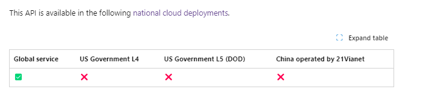
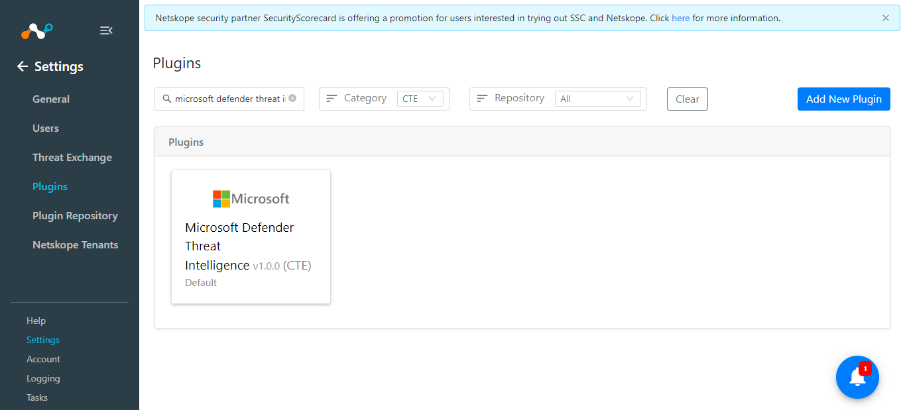
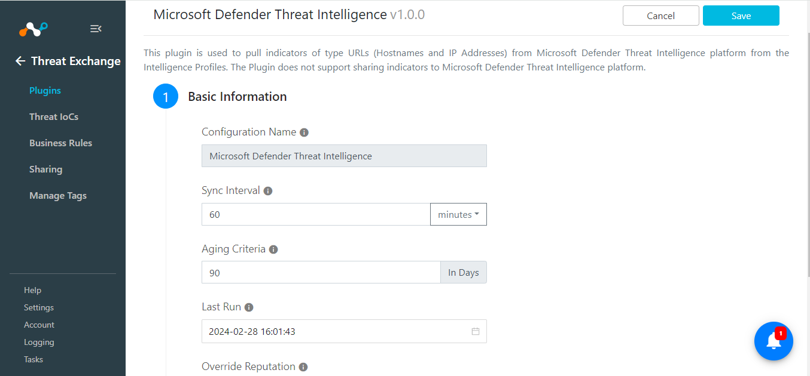
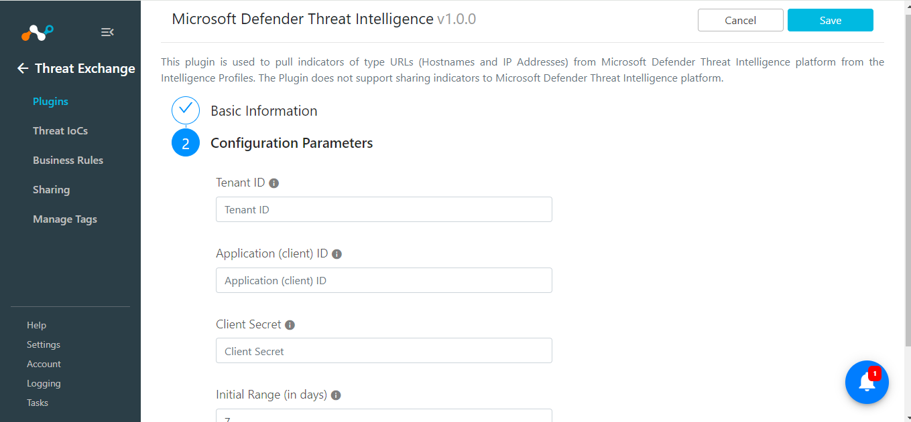
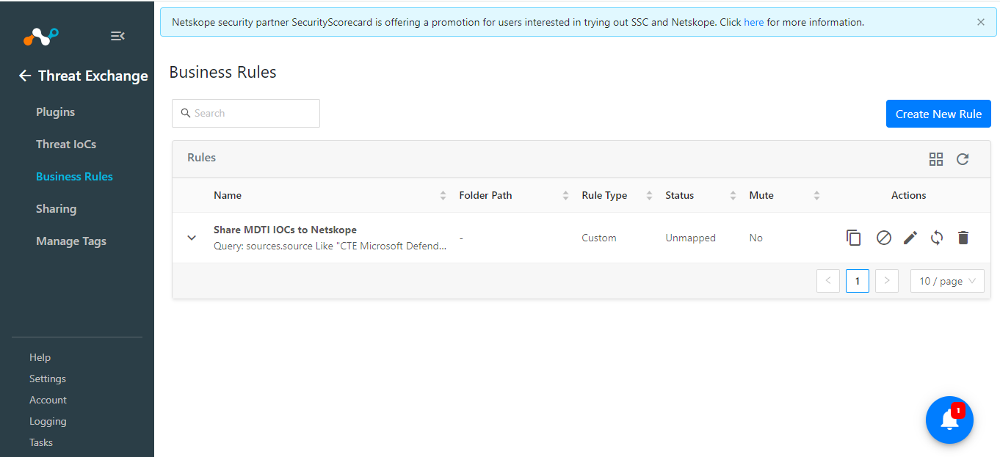

# CTE Microsoft Defender Threat Intelligence v1.0.0 Readme

## Release Notes
### 1.0.0
#### Added

- Initial Release.
- Fetch Indicators of type URL (Hostnames and IP Addresses) from the Threat Intelligence Profile along with their reputation. This plugin does not support pushing indicators to Microsoft Defender Threat Intelligence platform.

## Description

This plugin is used to pull indicators of type URLs (Hostnames and IP Addresses) from Microsoft Defender Threat Intelligence platform from the Intelligence Profiles. The Plugin does not support sharing indicators to Microsoft Defender Threat Intelligence platform.

## Plugin Scope

| Type of data supported        |    |                                     
|-------------------------------|------------------------------------------------------|
| Fetched indicator types       | URL (Hostnames, IP Address)                |
| Shared indicator types        |Not Supported                                                              |


**Note:** Only those Intelligence profiles will be fetched whose “kind” is “actor”.

- Kind: A categorization of the type of this intelligenceProfile. The possible values are: actor, tool, unknownFutureValue.(description from the doc)

## Prerequisites

- Netskope Tenant (or multiple, for example, production and development/test instances)
- Netskope Cloud Exchange: Threat Exchange Module.
- Application created on the Microsoft Identity platform's and it's Tenant ID, Client ID and Client Secret.


## Connectivity to the following hosts

- Connectivity to Microsoft Identity platform.
  
## Mappings

### Pull Mapping

|Netskope CE Fields|Microsoft Defender Threat Intelligence Fields |
|--|--|
|value  | artifact.id from List indicators response|
|type | URL (static)|
|firstSeen  | firstSeenDateTime|
|lastSeen  | lastSeenDateTime|
|reputation  | score from Get hostReputation response|
|tags  | classification from Get hostReputation response|
|comments|tradecraft.content from List Intelligence Profile|

The fields have been selected based on the description of the fields available on the platform as below:

- **Tradecraft:** Formatted information featuring a description of the distinctive tactics, techniques, and procedures (TTP) of the group, followed by a list of all known custom, commodity, and publicly available implants used by the group.
-  Reputation is mapped with score - the score can range from 1-100 so the mapping of score provided is using the following: normalized_score = round (score / 10), if the score is between 0-100 it will be considered as 1.

## Permissions

- ThreatIntelligence.Read.All (*attached to the Application whose Client Credentials are used).*

## API Details

### List of APIs used

|API Endpoint  |Method  | Use case  |
|--|--|-- |
| <TENANT_ID>/oauth2/token | POST|  Generate Auth Token|
| /security/threatIntelligence/intelProfiles | GET |  Fetch Intelligence Profiles |
| /security/threatIntelligence/intelProfiles/<INTEL_PROFILE_ID>/indicators |GET  |Fetch Indicator from a single Intelligence Profile |
|/security/threatIntelligence/hosts/<HOST_ID>/reputation  |GET  |  Fetching Reputation for a single indicator|


- **Note:** The List intelProfiles used in the plugin only supports Global Service as the National Cloud Deployments and hence the plugin supports only the below Base Endpoint: 
https://login.microsoftonline.com  - Hence this is used for Generating the Authorization Token.



- Microsoft Graph APIs Base URL for v1.0: https://graph.microsoft.com/v1.0/

### Get Auth Token

**Endpoint:** <TENANT_ID>/oauth2/token

**Method:** POST 

#### Data

|**Parameter**  | **Value** |
|--|--|
| scope | https://graph.microsoft.com/.default |
| client_id |<CLIENT_ID> |
| client_secret | <CLIENT_SECRET> |
| grant_type | client_credentials |

#### Headers

|  Key|Value  |
|--|--|
| User-Agent | netskope-ce-5.0.0-cte-microsoft-defender-threat-intelligence-v1.0.0 |
| Content-Type | application/x-www-form-urlencoded |
|Accept | application/json |

#### Sample Response

```
{
  "token_type": "Bearer",
  "expires_in": 3599,
  "ext_expires_in":3599,
  "access_token": "eyJ0eXAiOiJKV1QiLCJhbGciOiJSUzI1NiIsIng1dCI6Ik1uQ19WWmNBVGZNNXBP..."
}
```

### Fetching Intelligence Profile

**Endpoint:** /security/threatIntelligence/intelProfiles

**Method:** GET 

#### Params
|**Parameter**  | **Value** |
|--|--|
| $filter | firstActiveDateTime ge <checkpoint> |
| $select |id,tradecraft,kind |
| $top | 100 |

#### Headers

|  Key|Value  |
|--|--|
| User-Agent | netskope-ce-5.0.0-cte-microsoft-defender-threat-intelligence-v1.0.0 |
| Authorization | Bearer <ACCESS_TOKEN> |
|Content-Type | application/json |

#### Sample Response

```
HTTP/1.1 200 OK
Content-Type: application/json

{
  "value": [
    {
      "@odata.type": "#microsoft.graph.security.intelligenceProfile",
      "id": "9b01de37bf66d1760954a16dc2b52fed2a7bd4e093dfc8a4905e108e4843da80",
      "kind": "actor",
      "title": "Aqua Blizzard",
      "firstActiveDateTime": "2020-02-24T00:00:00Z",
      "aliases": [
          "Primitive Bear",
          "ACTINIUM",
          "SectorC08",
          "shuckworm",
          "Gamaredon",
          "UNC530",
          "Armageddon"
      ],
      "targets": [
          "Government Agencies & Services: Defense",
          "Government Agencies & Services: Law Enforcement",
          "Non-Government Organization: Human Rights Organization"
      ],
      "countriesOrRegionsOfOrigin": [
        {
          "@odata.type": "microsoft.graph.security.intelligenceProfileCountryOrRegionOfOrigin",
          "label": "Country/Region",
          "code": "Country/Region code"
        }
      ],
      "summary": {
        "@odata.type": "microsoft.graph.security.formattedContent",
        "content": "The actor that Microsoft tracks as Aqua Blizzard (ACTINIUM) is a nation-state activity group based out of ...",
        "format": "text"
      },
      "description": {
        "@odata.type": "microsoft.graph.security.formattedContent",
        "content": "## Snapshot\r\nThe actor that Microsoft tracks as Aqua Blizzard (ACTINIUM) is a nation-state activity group based out of ...",
        "format": "markdown"
      },
      "tradecraft": {
        "@odata.type": "microsoft.graph.security.formattedContent",
        "content": "Aqua Blizzard (ACTINIUM) primarily uses spear phishing emails to infect targets. These emails harness remote template injection to load malicious code or content. Typically, ...",
        "format": "markdown"
      }
    }
  ]
}
```

### Fetch Indicator from a single Intelligence Profile

**Endpoint:** /security/threatIntelligence/intelProfiles/<INTEL_PROFILE_ID>/indicators

**Method:** GET

**Data:** NA

#### Headers

|Parameter  | Value |
|--|--|
|User-Agent |netskope-ce-5.0.0-cte-cynet-v1.0.0  |
|Authorization |Bearer <ACCESS_TOKEN>  |
| Content-Type| application/json |

#### Sample Response:

```
  HTTP/1.1 200 OK
Content-Type: application/json

{
  "value": [
    {
      "@odata.type": "#microsoft.graph.security.intelligenceProfileIndicator",
      "id": "ff3eecd2-a2be-27c2-8dc0-40d1c0eada55",
      "source": "microsoft",
      "firstSeenDateTime": "2022-05-02T23:09:20.000Z",
      "lastSeenDateTime": null,
      "artifact": {
          "@odata.type": "#microsoft.graph.security.hostname",
          "id": "fake-malicious.site"
      }
    }
  ]
}
```

**Note:** artifact.id will be fetched as the indicator value

### Fetching Reputation for a single indicator

**Endpoint:** /security/threatIntelligence/hosts/<HOST_ID>/reputation

**Method:** GET

**Data:** NA

**Headers:**

|Parameter  | Value |
|--|--|
|User-Agent |netskope-ce-5.0.0-cte-cynet-v1.0.0  |
|Content-Type |application/x-www-form-urlencoded|
| Accept| application/json |

#### Sample Response

```
HTTP/1.1 200 OK
Content-Type: application/json

{
    "@odata.type": "#microsoft.graph.security.hostReputation",
    "id": "1e3b9ded-abb6-1828-c4ef-a5ca48b287a0",
    "classification": "malicious",
    "score": 100,
    "rules": [
      {
        "name": "Microsoft Defender Threat Intelligence Intel Article",
        "description": "Activity Snapshot: DPRK Actors Target Maritime Sector",
        "severity": "high",
        "relatedDetailsUrl": "https://ti.defender.microsoft.com/article/831b70a4"
      },
      {
        "name": "Name server",
        "description": "Domain is using a name server that has been associated with suspicious behavior",
        "severity": "medium",
        "relatedDetailsUrl": null
      },
      {
        "name": "Registrar",
        "description": "Domains registered using this registrar are frequently associated with suspicious behavior",
        "severity": "medium",
        "relatedDetailsUrl": null
      },
      {
        "name": "Resolving IP Address",
        "description": "192.168.1.1",
        "severity": "low",
        "relatedDetailsUrl": "https://ti.defender.microsoft.com/search?query=192.168.1.1"
      }
  ]
}
```

## User Agent

- netskope-ce-5.0.0-cte-microsoft-defender-threat-intelligence-v1.0.0

## Workflow

- Generate configuration parameter
- Configure the Netskope Tenant
- Configure the Netskope CTE plugin
- Configure the Cynet plugin
- Add Business Rule
- Add Sharing

## Configuration on Microsoft Identity platform

### Generating the configuration parameter

Follow steps added in the below link to generate the neccessary plugin credentials.

- **Register the Application:** https://learn.microsoft.com/en-us/graph/auth/auth-concepts#register-the-application
https://learn.microsoft.com/en-us/graph/auth-register-app-v2
- **Add Client Secret:** https://learn.microsoft.com/en-us/graph/auth-register-app-v2#option-2-add-a-client-secret
- **Configure Permissions for Microsoft Graph:** https://learn.microsoft.com/en-us/graph/auth-v2-service?tabs=http#2-configure-permissions-for-microsoft-graph
- **Permission needed:** ThreatIntelligence.Read.All
- **Request administrator consent:** https://learn.microsoft.com/en-us/graph/auth-v2-service?tabs=http#3-request-administrator-consent

## Configuration on Netskope Tenant

Follow the steps provided in the below document to configure the Netskope Tenant:
https://docs.netskope.com/en/netskope-help/integrations-439794/netskope-cloud-exchange/get-started-with-cloud-exchange/configure-netskope-tenants/

Follow the steps provided in the below document to configure the URL List on Netskope Tenant:
https://docs.netskope.com/en/netskope-help/data-security/real-time-protection/custom-category/url-lists/

Follow the steps provided in the below document in order to configure the Netskope plugin on Cloud Exchange.
https://docs.netskope.com/en/netskope-help/integrations-439794/netskope-cloud-exchange/get-started-with-cloud-exchange/configure-the-netskope-plugin-for-threat-exchange/

## Configuration on Netskope CE

### Microsoft Defender Threat Intelligence Plugin configuration

- Login to your Netskope CE and navigate to Settings > Plugins.
- Search for the CTE Microsoft Defender Threat Intelligence plugin and click on the plugin box to configure the plugin.



- Fill out the form with these values:
	- **Configuration Name:** Unique name for the configuration
	- **Sync Interval:** Leave default
	- **Aging Criteria:** Expiry time of the plugin in days. ( Default: 90 )
	- **Override Reputation:** Set a value to override the reputation of indicators received from this configuration.
	- **Enable SSL Validation:** Enable SSL Certificate validation.
	- **Use System Proxy:** Enable if the proxy is required for communication
   


- Click on Next and provide the below details.
	- **Tenant ID:** Tenant ID of your Azure application.
	- **Application (client) ID:** Application (client) ID of your Azure application.
	- **Client Secret:** Client Secret of your Azure application.
	- **Initial Range:** Number of days Threat IoCs to pull in the initial run.



### Add Business Rule

To share indicators fetched from the Microsoft Defender Threat Intelligence to the Netskope and vice versa you will need to have a business rule that will filter out the indicators that you want to share. To configure a business rule follow the below steps:

- Go to Threat Exchange > Business Rule > Create New Rule.
- Add the filter according to your requirement in the rule.
  


### Add Sharing

To share IOCs pulled from the Microsoft Defender Threat Intelligence to Netskope CE follow the below steps:

- Go to Threat Exchange > Sharing. Click on the Add Sharing Configuration button.
- Select your Source Configuration (Microsoft Defender Threat Intelligence), Business Rule, Destination Configuration (CTE Netskope), and Target.

**NOTE:** Since this plugin does not support sharing IOCs from Netskope CE to the Microsoft Defender Threat Intelligence platform, you can share the IOCs pulled from it and share it to Netskope. Follow steps available in the above [Netskope plugin configuration guide](https://docs.netskope.com/en/netskope-help/integrations-439794/netskope-cloud-exchange/get-started-with-cloud-exchange/configure-the-netskope-plugin-for-threat-exchange/) in order to share IOCs pulled from Microsoft Defender Threat Intelligence plugin to Netskope tenants.
