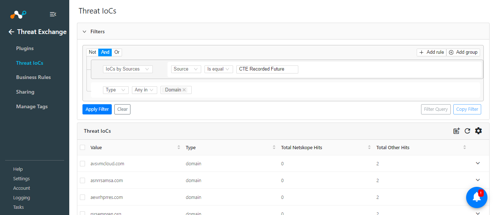

# CTE Recorded Future v1.0.0 Readme

## Release Notes
### 1.0.0
#### Added

- Initial Release.
- This plugin is used to pull indicators of type URL, Domain, IP Addresses (IPv4, IPv6) and Hash (MD5 and SHA256) from the risk list of Recorded Future platform. This plugin does not support sharing of indicators to Recorded Future.

## Description

This plugin is used to pull indicators of type URL, Domain, IP Addresses (IPv4, IPv6) and Hash (MD5 and SHA256) from the risk list of Recorded Future platform. This plugin does not support sharing of indicators to Recorded Future.

## Plugin Scope

| Type of data supported        |    |                                     
|-------------------------------|------------------------------------------------------|
| Fetched indicator types       | URL, Domain, IP Addresses (IPv4, IPv6) and Hash (MD5 and SHA256)  |
| Shared indicator types        |Not Supported   |

## Prerequisites

- Netskope Tenant (or multiple, for example, production and development/test instances)
- Netskope Cloud Exchange: Threat Exchange Module
- Recorded Future API Key


## Connectivity to the following hosts

- Connectivity to Recorded Future instance

## Mappings

### Pull Mapping

|Netskope CE Fields|Recorded Future Fields |
|--|--|
|value  |Name|
|severity|Risk|
|comments|EvidenceDetails|

### Severity Mapping

|Netskope CE Severity|Recorded Future Risk |
|--|--|
|Unknown  |0|
|Low|1-39|
|Medium|40-69|
|High |70-89|
|Critical|>=90|

## API Details

### List of APIs used

|API Endpoint  |Method  | Use case  |
|--|--|-- |
| /v2/{<IOC_TYPE>}/risklist|GET|Fetch Indicators|

### Fetch Indicators

**Endpoint:** /v2/{<IOC_TYPE>}/risklist

**Method:** GET

**Headers**
|Key|Value |
|--|--|
|User-Agent  |netskope-ce-5.0.1-cte-recorded-future-v1.0.0|
|X-RFToken|API Key|
|Accept|application/json|
|Content-Type |application/json|

#### Sample API Response
```
"Name","Risk","RiskString","EvidenceDetails"
"176.111.174.140","99","13/79","{""EvidenceDetails"": [{""Name"": ""linkedIntrusion"", ""EvidenceString"": ""1 sighting on 1 source: Twitter. 2 related intrusion methods: AsyncRAT, Remote Access Trojan. Most recent link (Jul 28, 2024): https://twitter.com/drb_ra/statuses/1817451627755839630"", ""CriticalityLabel"": ""Unusual"", ""MitigationString"": """", ""Rule"": ""Historically Linked to Intrusion Method"", ""SourcesCount"": 1.0, ""Sources"": [""source:BV5""], ""Timestamp"": ""2024-07-28T06:46:49.000Z"", ""SightingsCount"": 1.0, ""Criticality"": 1.0}, {""Name"": ""defanged"", ""EvidenceString"": ""3 sightings on 2 sources: Mastodon, Twitter. Most recent link (Jul 29, 2024): https://ioc.exchange/@SarlackLab/112867604780656776"", ""CriticalityLabel"": ""Unusual"", ""MitigationString"": """", ""Rule"": ""Historically Reported as a Defanged IP"", ""SourcesCount"": 2.0, ""Sources"": [""source:pupSAn"", ""source:BV5""], ""Timestamp"": ""2024-07-29T03:16:13.000Z"", ""SightingsCount"": 3.0, ""Criticality"": 1.0}, {""Name"": ""botnet"", ""EvidenceString"": ""3 sightings on 1 source: External Sensor Data Analysis. 176.111.174.140 was identified as botnets in External Sensor data. Reported to Recorded Future on Aug 23, 2024."", ""CriticalityLabel"": ""Unusual"", ""MitigationString"": """", ""Rule"": ""Historical Botnet Traffic"", ""SourcesCount"": 1.0, ""Sources"": [""source:kBB1fk""], ""Timestamp"": ""2024-08-23T22:00:19.772Z"", ""SightingsCount"": 3.0, ""Criticality"": 1.0}, {""Name"": ""reportedCnc"", ""EvidenceString"": ""969 sightings on 3 sources: Polyswarm Sandbox Analysis - Malware C2 Extractions, Recorded Future Triage Malware Analysis - Malware C2 Extractions, Recorded Future Sandbox - Malware C2 Extractions. Malware sandbox analysis identified 176.111.174.140:6606 as possible TA0011 (Command and Control) for AsyncRAT using configuration extraction on sample 25bd8d029f3ef404bb2153867d366571b26e2fcfbb4819175dc8c490e8252c74."", ""CriticalityLabel"": ""Suspicious"", ""MitigationString"": """", ""Rule"": ""Historically Reported C&C Server"", ""SourcesCount"": 3.0, ""Sources"": [""source:hyihHO"", ""source:nTcIsu"", ""source:oWAG20""], ""Timestamp"": ""2024-08-16T00:30:01.000Z"", ""SightingsCount"": 969.0, ""Criticality"": 2.0}, {""Name"": ""recentLinkedIntrusion"", ""EvidenceString"": ""1 sighting on 1 source: Twitter. 1 related intrusion method: Botnet. Most recent link (Aug 29, 2024): https://twitter.com/ShanHolo/statuses/1829217577702150517"", ""CriticalityLabel"": ""Suspicious"", ""MitigationString"": """", ""Rule"": ""Recently Linked to Intrusion Method"", ""SourcesCount"": 1.0, ""Sources"": [""source:BV5""], ""Timestamp"": ""2024-08-29T18:00:30.000Z"", ""SightingsCount"": 1.0, ""Criticality"": 2.0}, {""Name"": ""intermediateActiveCnc"", ""EvidenceString"": ""4 sightings on 1 source: Recorded Future Network Intelligence. Multiple communications observed between 104.237.6.220 on port 50420 and 176.111.174.140 (validated AsyncRAT C2 Server) on port 6606 on 2024-08-27 at 09:28 UTC.  "", ""CriticalityLabel"": ""Suspicious"", ""MitigationString"": """", ""Rule"": ""Recently Communicating Validated C&C Server"", ""SourcesCount"": 1.0, ""Sources"": [""source:gs6Zfb""], ""Timestamp"": ""2024-08-27T00:00:00.000Z"", ""SightingsCount"": 4.0, ""Criticality"": 2.0}, {""Name"": ""validatedCnc"", ""EvidenceString"": ""159 sightings on 1 source: Recorded Future Command & Control Validation. Recorded Future analysis validated 176.111.174.140:7707 as a command and control server for AsyncRAT on Aug 28, 2024"", ""CriticalityLabel"": ""Suspicious"", ""MitigationString"": """", ""Rule"": ""Previously Validated C&C Server"", ""SourcesCount"": 1.0, ""Sources"": [""source:qGriFQ""], ""Timestamp"": ""2024-08-28T05:24:09.000Z"", ""SightingsCount"": 159.0, ""Criticality"": 2.0}, {""Name"": ""recentMalwareDelivery"", ""EvidenceString"": ""48 sightings on 1 source: URLHaus Infrastructure Analysis. http://176.111.174.140/event.php delivered a payload, a38e3e82e522f7ecedfc51da3b44b9013bde09383f565a79a31b36e2e313c60c, which was assessed as an unidentified malware on 2024-08-28 17:00:42. When reported, this URL resolved to 176.111.174.140. Most recent link (Aug 28, 2024): https://urlhaus.abuse.ch/url/3076639"", ""CriticalityLabel"": ""Suspicious"", ""MitigationString"": """", ""Rule"": ""Recent Malware Delivery"", ""SourcesCount"": 1.0, ""Sources"": [""source:mbf07-""], ""Timestamp"": ""2024-08-28T17:00:42.000Z"", ""SightingsCount"": 48.0, ""Criticality"": 2.0}, {""Name"": ""recentPhishingHost"", ""EvidenceString"": ""48 sightings on 1 source: URLHaus Infrastructure Analysis. http://176.111.174.140/event.php delivered a payload, a38e3e82e522f7ecedfc51da3b44b9013bde09383f565a79a31b36e2e313c60c, which was assessed as an unidentified malware on 2024-08-28 17:00:42. When reported, this URL resolved to 176.111.174.140. Most recent link (Aug 28, 2024): https://urlhaus.abuse.ch/url/3076639"", ""CriticalityLabel"": ""Suspicious"", ""MitigationString"": """", ""Rule"": ""Recent Phishing Host"", ""SourcesCount"": 1.0, ""Sources"

```

## User Agent

- netskope-ce-5.0.1-cte-recorded-future-v1.0.0

## Workflow

- Configure the Netskope Tenant
- Configure the Netskope CTE plugin
- Configure the Recorded Future plugin
- Add Business Rule
- Add Sharing

## Configuration on Netskope Tenant

Follow the steps provided in the below document to configure the Netskope Tenant:
https://docs.netskope.com/en/netskope-help/integrations-439794/netskope-cloud-exchange/get-started-with-cloud-exchange/configure-netskope-tenants/

Follow the steps provided in the below document to configure the URL List on Netskope Tenant:
https://docs.netskope.com/en/netskope-help/data-security/real-time-protection/custom-category/url-lists/

Follow the steps provided in the below document in order to configure the Netskope plugin on Cloud Exchange.
https://docs.netskope.com/en/netskope-help/integrations-439794/netskope-cloud-exchange/get-started-with-cloud-exchange/configure-the-netskope-plugin-for-threat-exchange/

## Configuration on Netskope CE

### Recorded Future Plugin configuration

- Login to your Netskope CE and navigate to Settings > Plugins. Search for the CTE Recorded Future plugin and click on the plugin box to configure the plugin.


- Fill out the form with these values:
	- **Configuration Name:** Unique name for the configuration
	- **Sync Interval:** Leave default
	- **Aging Criteria:** Expiry time of the plugin in days. ( Default: 90 )
	- **Override Reputation:** Set a value to override the reputation of indicators received from this configuration.
	- **Enable SSL Validation:** Enable SSL Certificate validation.
	- **Use System Proxy:** Enable if the proxy is required for communication
   


- Click on Next and provide the below details.
    - **API Key:** API Key for the Recorded Future platform.
    - **Risk Lists:** Type of threat indicator you want to pull based on the risk lists available.
    - **Fetch Evidences:** Allow to import all IOC evidence into the comments field.


### Add Business Rule

To share indicators fetched from the Recorded Future to the Netskope you will need to have a business rule that will filter out the indicators that you want to share. To configure a business rule follow the below steps:

- Go to Threat Exchange > Business Rule > Create New Rule.
- Add the filter according to your requirement in the rule.
  


### Add Sharing

To share IOCs from the Recorded Future to the Netskope follow the below steps:

- Go to Threat Exchange > Sharing. Click on the Add Sharing Configuration button.
- Select your Source Configuration (CTE Recorded Future), Business Rule, Destination Configuration (CTE Netskope), and Target, based on your requirement. 
- Refer to [Netskope plugin guide](https://docs.netskope.com/en/netskope-help/integrations-439794/netskope-cloud-exchange/get-started-with-cloud-exchange/configure-the-netskope-plugin-for-threat-exchange/) in order to share data to Netskope.

### Validation
To validate the data pulled from the plugin in Netskope CE go to Logging and search for the logs from CTE Recorded Future.


To check the data stored in CE, go to Threat IoCs page under Threat Exchange, and search for IOCs pulled from the Recorded Future plugin.


**Example:** sources.source Is equal "CTE Recorded Future" 


