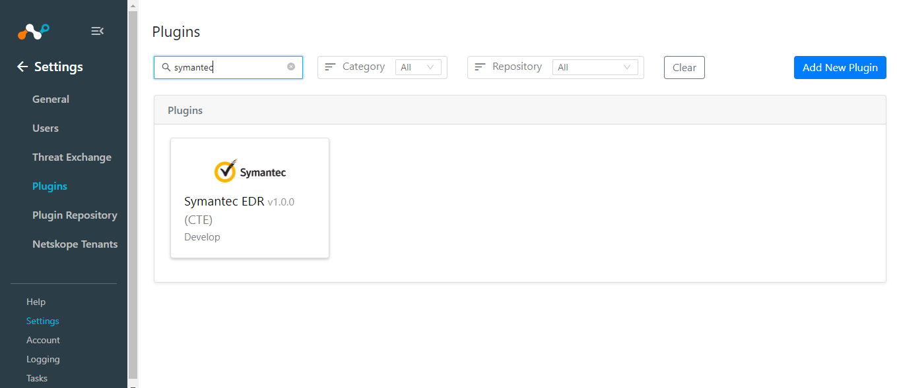
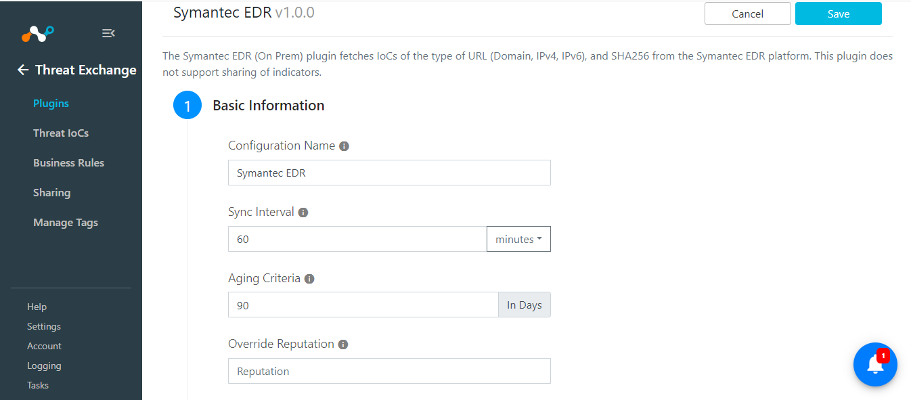
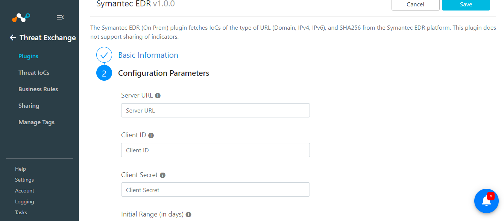
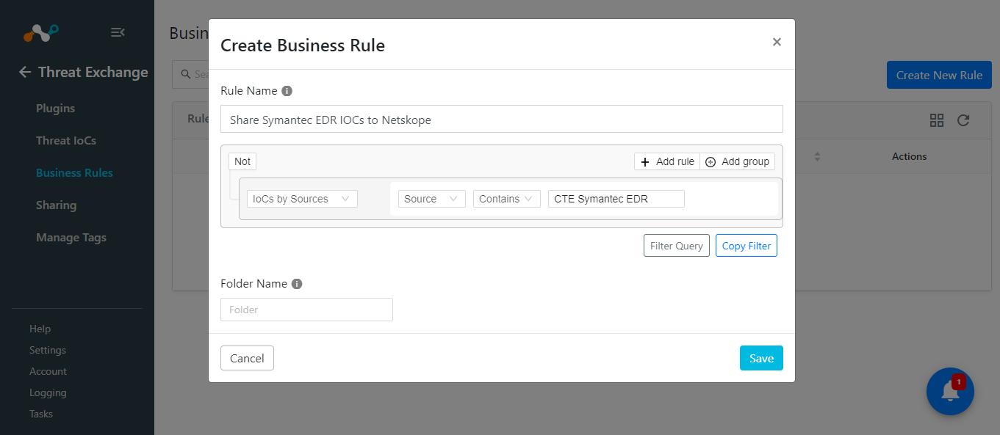
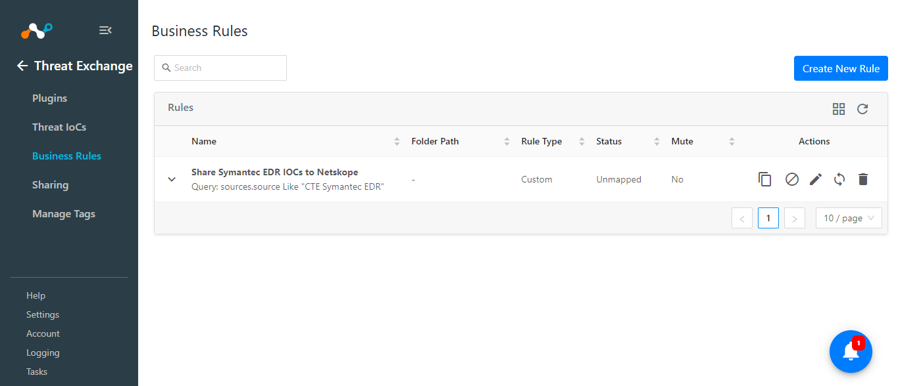

# CTE Symantec EDR v1.0.0 Readme

## Release Notes
### 1.0.0
#### Added

- Initial Release.
- Symantec EDR plugin (On Prem) fetches IoCs of the type of URL (Domain, IPv4, IPv6), and SHA256 from the Symantec EDR Entities Endpoint. This plugin does not support sharing of indicators.

## Description

The Symantec EDR (On Prem) plugin fetches IoCs of the type of URL (Domain, IPv4, IPv6), and SHA256 from the Symantec EDR platform. This plugin does not support sharing of indicators.

## Plugin Scope

| Type of data supported        |    |                                     
|-------------------------------|------------------------------------------------------|
| Fetched indicator types       | URL (Domains, IPv4 and IPv6), SHA256  |
| Shared indicator types        |Not Supported   |

## Prerequisites

- Netskope Tenant (or multiple, for example, production and development/test instances)
- Netskope Cloud Exchange: Threat Exchange Module
- Netskope CTE Plugin
- Connectivity to Symantec EDR platform

## Connectivity to the following hosts

- Connectivity to Symantec EDR instance.

## Mappings

### Pull Mapping

|Netskope CE Fields|Symantec EDR Fields |
|--|--|
|value  | sha2, data_source_url_domain, device_ip|
|firstSeen  | first_seen|
|lastSeen  | last_seen|
|severity|disposition, file_health|

**NOTE:** Severity is mapped with both disposition and file_health, as we receive disposition while fetching the URLs and file_health while fetching the hash values.

### Severity - Disposition Mapping

|Netskope CE Severity|Symantec EDR Disposition |
|--|--|
|Unknown  |1 = unknown|
|Low  | 0 = healthy/good|
|High  | 2 = suspicious|
|Critical|3 = bad|

### Severity - file_health Mapping

|Netskope CE Severity|Symantec EDR file_health |
|--|--|
|Unknown  | 2 = unknown |
|Low  | 1 = good|
|High  | 3 = suspicious|
|Critical|4 = bad|
|Medium|6 = leaning good|

## API Details

### List of APIs used

|API Endpoint  |Method  | Use case  |
|--|--|-- |
| /atpapi/oauth2/tokens| POST|To get bearer token|
|/atpapi/v2/entities |POST  | Pull entities from Symantec EDR platform|

### Get Bearer Token

**Endpoint:** /atpapi/oauth2/tokens

**Method:** POST 

**Content-Type:** application/x-www-form-urlencoded

**Accept:** application/json

**Authorization:** Bearer {token}

#### Request Body
```
{
    "client_id": "5106b812*****5c1cb53b38f4862b",
    "client_secret": "9N8yf8aAZ8ZOMQ0NtUO-gb3KYWvBukUCIm&*********",
    "grant_type": "client_credentials"
}
```

#### Sample Response - Status Code 200 OK

```
{
    "access_token":"eyJra...HakA",
    "token_type":"Bearer",
    "expires_in":3600
}  
```

### Pull Entities

**Endpoint:** /atpapi/v2/entities

**Method:** POST

**Content-Type:** application/json

**Accept:** application/json

**Authorization:** Bearer {token}

#### Request Body

```
{"verb":"query","limit":1}
```

#### Sample Response - Status Code 200 OK

```
{
    "next":"ZW50aXRpZXM7MTUyMTExMjY3NTM1MTswOkRYRjFaWEo1UVc1a1JtVjB******************TE9WRnRlV0ZSVUVjelVreEdhVmRJV0hSdFFRPT0=,
    "result": [ 
        {
            "file_health": 4,
            "first_seen": "2018-03-12T19:25:41.708Z",
            "is_targeted": false,
            "last_seen": "2018-03-14T10:21:09.297Z",
            "md5": "30b02b4d8e5c95aa25b864d9be46e54e",
            "name": "sample[1].exe",
            "prevalence_band": 0,
            "sandbox_verdict": "malware",
            "sha2": "4cbaa39e03c088b7e44d31722f099fb8030753bad30ba09edcb27490f7802cd9",
            "size": 33824,
            "type": "file_latest"
        }
    ]
    "total": 2
}
```

## User Agent

- netskope-ce-5.0.1-cte-symantec-edr-v1.0.0

## Workflow

- Configure on Netskope Tenant and URL List
- Configure Netskope CTE plugin
- Configure Symantec EDR plugin
- Add Business Rule
- Add Sharing

## Configuration on Netskope Tenant

Follow the steps provided in the below document to configure the Netskope Tenant:

https://docs.netskope.com/en/netskope-help/integrations-439794/netskope-cloud-exchange/get-started-with-cloud-exchange/configure-netskope-tenants/

Follow the steps provided in the below document to configure the URL List on Netskope Tenant:

https://docs.netskope.com/en/netskope-help/data-security/real-time-protection/custom-category/url-lists/

Follow the steps provided in the below document in order to configure the Netskope plugin on Cloud Exchange:

https://docs.netskope.com/en/netskope-help/integrations-439794/netskope-cloud-exchange/get-started-with-cloud-exchange/configure-the-netskope-plugin-for-threat-exchange/

## Configuration on Netskope CE

### Symantec EDR Plugin configuration

- Login to your Netskope CE and navigate to Settings > Plugins. Search for the CTE Symantec EDR plugin and click on the plugin box to configure the plugin.



- Fill out the form with these values:
	- **Configuration Name:** Unique name for the configuration.
	- **Sync Interval:** Leave default.
	- **Aging Criteria:** Expiry time of the plugin in days ( Default: 90 ).
	- **Override Reputation:** Set a value to override the reputation of indicators received from this configuration.
	- **Enable SSL Validation:** Enable SSL Certificate validation.
	- **Use System Proxy:** Enable if the proxy is required for communication.
   


- Click on Next and provide the below details.
    - **Server URL:** Symantec EDR (On Prem) Appliance URL, i.e., https://host:port.
    - **Client ID:** Client ID from Symantec EDR (On Prem) Appliance.
    - **Client Secret:** Client Secret from Symantec EDR (On Prem) Appliance.
    - **Initial Range:** Number of days to pull the data for the initial run.



### Add Business Rule

To share indicators fetched from the Symantec EDR to the Netskope you will need to have a business rule that will filter out the indicators that you want to share. To configure a business rule, follow the below steps:

- Go to Threat Exchange > Business Rule > Create New Rule.
- Add the filter according to your requirement in the rule.

  





### Add Sharing

**NOTE:** Since this plugin does not support sharing IOCs to the Symantec EDR platform, you can share the IOCs pulled from Symantec EDR and share it to Netskope. Follow steps available in the [Netskope plugin configuration guide](https://docs.netskope.com/en/netskope-help/integrations-439794/netskope-cloud-exchange/get-started-with-cloud-exchange/configure-the-netskope-plugin-for-threat-exchange/) in order to share IOCs pulled from Symantec EDR plugin to Netskope tenants.